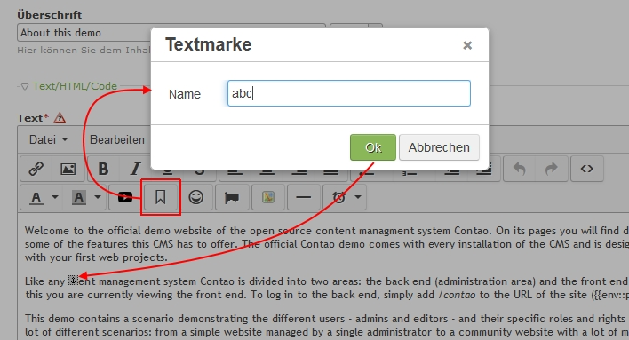

Contao Extension: TinyMceAnchor
===============================

Special TinyMCE plugin that adds an anchor/bookmark button and menu.

The sources of this plugin could be found [here](http://www.tinymce.com/wiki.php/Plugin:anchor).

Installation
------------

Install the extension via composer: [cliffparnitzky/tiny-mce-anchor](https://packagist.org/packages/cliffparnitzky/tiny-mce-anchor).

If you prefer to install it manually, download the latest release here: https://github.com/cliffparnitzky/TinyMceAnchor/releases

Tracker
-------

https://github.com/cliffparnitzky/TinyMceAnchor/issues

Compatibility
-------------

- min. Contao version: >= 3.3.0
- max. Contao version: <  3.5.0

Dependency
----------

- To load this plugin and add it to the configuration the extension [[TinyMcePluginLoader]](https://github.com/cliffparnitzky/TinyMcePluginLoader) has to be installed.

Screenshot
----------

